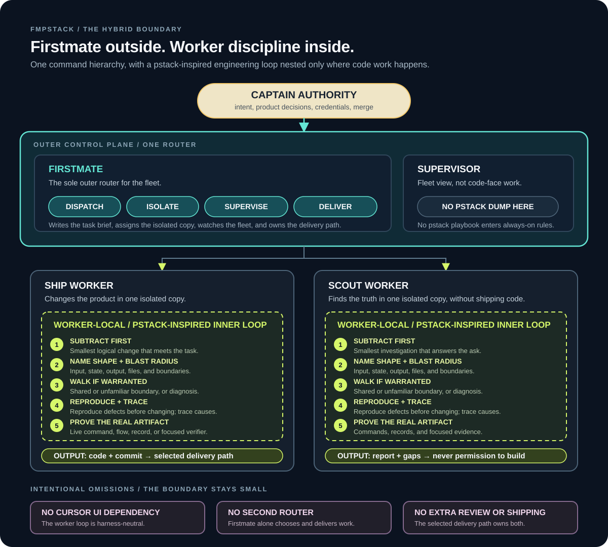

<h1 align="center">fmpstack</h1>
<p align="center">
  <a href="https://img.shields.io/badge/platform-macOS%20%7C%20Linux-blue?style=flat-square">
    
  </a>
  <a href="https://github.com/kunchenguid/firstmate">
    
  </a>
  <a href="https://github.com/cursor/plugins/tree/main/pstack">
    
  </a>
</p>

<h3 align="center">Firstmate runs the fleet. A pstack-inspired loop runs inside each worker.</h3>

<p align="center">
  <picture>
    <source media="(max-width: 600px)" srcset="assets/fmpstack-hybrid-narrow.svg" />
    
  </picture>
</p>

<p align="center">
  <a href="https://claude.ai/code/artifact/f96649d5-b82c-4199-b155-2a8c691a7eda?via=auto_preview">Open the interactive companion</a>
</p>

## What it is

[fmpstack](https://github.com/hero-park/fmpstack) combines [Firstmate](https://github.com/kunchenguid/firstmate) fleet orchestration with a small, harness-neutral engineering loop inspired by [pstack](https://github.com/cursor/plugins/tree/main/pstack).

You still talk to one first mate.
The first mate still chooses work, creates isolated worktrees, dispatches agents, supervises the fleet, and owns delivery.
The pstack-inspired discipline begins only after a ship or scout worker receives its brief.

That separation is the point.
Two routers would compete over work, isolation, and shipping.
fmpstack keeps Firstmate as the sole outer router and nests the engineering loop inside the worker that is doing the task.

The static diagram above is complete on its own.
The interactive companion expands the same boundary without being required to understand or use fmpstack.

The loop is delivered through the same generated brief used by every supported worker adapter.
It does not require Cursor, a Cursor plugin, a second orchestrator, or harness-specific prompt wiring.
Claude Code, Codex, OpenCode, Pi, `pi-signed`, Grok, Kimi, Cursor Agent CLI, and Muse workers all receive the same contract through their existing Firstmate launch path.

fmpstack is not a model, a harness, an MCP server, or a separate fleet application.
It is an agent distro: a portable directory of instructions, skills, scripts, policies, and state conventions that turns a supported terminal coding agent into a first mate with a disciplined crew.

## The hybrid boundary

Firstmate remains the outer control plane.
fmpstack adds one engineering inner loop to generated ship and scout briefs, and nowhere else.

The [worker engineering contract in `bin/fm-brief.sh`](bin/fm-brief.sh) owns the procedure, including conditional checks for measured performance or evaluation claims.

Scout reports also name every material verification gap so inference cannot masquerade as evidence.
The selected Firstmate delivery mode remains the only owner of review and shipping.
The intentional omissions are part of the design: no Cursor UI dependency, no second router, and no extra review or shipping ceremony.

The detailed boundary lives in [The engineering inner loop stays inside workers](docs/architecture.md#the-engineering-inner-loop-stays-inside-workers).

## Features

- **One liaison** - you talk only to the first mate, which dispatches, supervises, escalates real decisions, and reports outcomes.
- **One router** - Firstmate alone owns task selection, isolation, fleet supervision, and delivery.
- **A harness-neutral inner loop** - every ship and scout worker gets the same engineering play through its generated brief.
- **Conditional architecture walks** - workers inspect system shape only when unfamiliarity, shared boundaries, or diagnosis justify it.
- **Real-artifact proof** - workers verify the changed command, flow, record, or local artifact instead of treating tests-exist as done.
- **Visible workers** - each crewmate runs in its own tmux window, Herdr or Zellij tab, cmux workspace, or Orca terminal.
- **Disposable worktrees** - each task uses a clean Treehouse worktree or an Orca-managed worktree so parallel agents do not collide.
- **Two task shapes** - ship tasks deliver authorized changes, while scout tasks leave standalone evidence-backed reports.
- **Explicit delivery modes** - projects ship through `no-mistakes`, `direct-PR`, or `local-only`, with optional `+yolo` merge authority.
- **Optional secondmates** - persistent second mates run isolated Firstmate homes locally or on SSH-reachable hosts.
- **Event-driven supervision** - a zero-token watcher sleeps on the fleet and wakes the first mate only when action is needed.
- **Strict project boundaries** - the first mate remains read-only over project work while crewmates make changes in isolated copies.
- **Restart-proof state** - durable records and backend inventory let a restarted first mate reconcile and continue.
- **Optional Relay** - an opted-in fleet can receive and answer supported public mentions through the normal task lifecycle.

## Quick Start

### Requirements

- A verified primary harness: Claude Code, Grok, Pi, `pi-signed`, Codex, OpenCode, or Cursor Agent CLI.
- Git and the GitHub CLI, authenticated with `gh auth login`.
- The CLI and dependencies for the selected runtime backend.
- tmux for the reference default backend, or the documented setup for Herdr, Zellij, Orca, or cmux.

The first mate detects missing supported tools and asks before installing them.

### Install

```sh
gh auth login
git clone git@github.com:hero-park/fmpstack.git
cd fmpstack
```

### Launch

Launch one supported primary harness from the repository root.
`AGENTS.md` takes over from there.

**Claude Code**

```sh
claude
```

**Grok**

```sh
grok --trust
```

**Pi**

```sh
pi
# Or use the signed wrapper when installed.
FM_PI_HARNESS=pi-signed pi-signed
```

For Grok, `--trust` is required once per clone so project hooks load.
For Pi, approve the project trust prompt once so the tracked `.pi/extensions/*.ts` files load.
Cursor Agent CLI must be launched interactively with `--trust` so project hooks run.

### Ask for work

```text
> ahoy! fix the flaky login test and add dark mode to project xyz
```

The first mate resolves the project and delivery posture, creates separate task briefs, and dispatches isolated workers.
Each worker follows the fmpstack inner loop inside its own task.
The first mate continues to supervise and returns finished PRs, approved local branches, or scout reports.

## How It Works

The diagram above is the command map: the captain directs Firstmate, Firstmate alone routes and supervises isolated ship and scout workers, and the pstack-inspired loop stays nested inside those workers.

The control hierarchy is deliberate:

1. The captain owns product decisions, credentials, destructive actions, and merge authority unless an explicit standing posture says otherwise.
2. Firstmate owns routing, isolation, supervision, and delivery.
3. Ship and scout crewmates own the task-local engineering loop.
4. The selected delivery path owns review and shipping rigor.

The primary first mate and persistent secondmates do not receive the worker inner-loop dump as an always-loaded policy.
They remain fleet operators rather than code-face workers.

## Runtime and harness independence

The runtime backend and agent harness are separate choices.

The runtime backend decides where worktrees and terminals live:

- tmux
- Herdr
- Zellij
- Orca
- cmux

The worker harness decides which coding agent runs inside that endpoint:

- Claude Code
- Codex
- OpenCode
- Pi and `pi-signed`
- Grok
- Kimi
- Cursor Agent CLI
- Muse for crewmates and scouts

`bin/fm-brief.sh` generates the engineering contract before either choice matters.
Every adapter consumes that same brief, which is why the hybrid does not need per-harness pstack integration.

## Delivery modes

fmpstack preserves Firstmate's explicit task delivery modes.

- **`no-mistakes`** - the worker implements and commits, then the no-mistakes pipeline owns review, tests, lint, documentation, push, PR creation, and CI.
- **`direct-PR`** - the worker implements, commits, pushes its task branch, and opens a PR without the no-mistakes pipeline.
- **`local-only`** - the worker leaves a clean task branch and Firstmate performs the guarded local fast-forward after approval.

The pstack-inspired loop ends by proving the artifact.
It does not replace or duplicate these delivery gates.

## Built-in skills

fmpstack inherits Firstmate's user-invocable skills.
Claude Code and Grok use the slash spelling shown below, while Codex uses `$`, such as `$afk`.

| Skill | What it does |
| --- | --- |
| `/afk` | Enters away-mode supervision and escalates only captain-relevant events or bounded external waits. |
| `/ahoy` | Recaps visible fleet events and walks through open captain decisions. |
| `/bearings` | Produces a bounded four-section fleet digest, with optional file output and live PR enrichment. |
| `/updatefirstmate` | Fast-forwards the running distro and registered secondmate homes, then refreshes their instructions. |
| `/stow` | Persists durable session knowledge, curates startup memory, and reports what is safe to reset. |

The inherited `/updatefirstmate` name is retained for compatibility with Firstmate's scripts and skills.

Agent-only reference skills live under `.agents/skills/` and load only at the trigger points named in [`AGENTS.md`](AGENTS.md).
Standalone installer-facing skills live under `skills/`.

## Repository layout

```text
AGENTS.md          first mate operating contract
assets/            repository-owned README visuals
bin/               fleet, brief, backend, watcher, and lifecycle helpers
.agents/skills/    internal Firstmate skills
skills/            standalone installer-facing skills
docs/              architecture, configuration, backend, and verification guides
config/            local operating choices, gitignored
data/              durable private fleet records, gitignored
state/             runtime records and watcher state, gitignored
projects/          project clones, gitignored
```

The fmpstack-specific worker behavior is intentionally small.
Its executable owner is `bin/fm-brief.sh`, its behavioral coverage is in `tests/fm-brief.test.sh`, and its architecture boundary is documented in `docs/architecture.md`.

## Documentation

- [Architecture](docs/architecture.md) - fleet architecture, worker isolation, delivery modes, and the fmpstack inner-loop boundary.
- [Configuration](docs/configuration.md) - `FM_HOME`, harness dispatch, runtime backend selection, Relay, and local configuration files.
- [Extension bindings](docs/extension-bindings.md) - trusted external process-event package and evidence boundaries.
- [Remote secondmates](docs/remote-secondmates.md) - persistent local and remote secondmate operation.
- [Pi Calm](docs/calm.md) - supported Pi `/calm` behavior and presentation limits.
- [Voice Relay](docs/voice-relay.md) - optional spoken interface setup and current limits.
- [Wedge alarms](docs/wedge-alarm.md) - active alerts for stuck away-mode escalation delivery.
- [tmux backend](docs/tmux-backend.md) - reference backend setup and operation.
- [Herdr backend](docs/herdr-backend.md) - experimental Herdr backend setup and safety boundaries.
- [Zellij backend](docs/zellij-backend.md) - experimental Zellij backend setup and limits.
- [Orca backend](docs/orca-backend.md) - setup and current Orca backend limits.
- [cmux backend](docs/cmux-backend.md) - experimental cmux backend setup and socket security.
- [Codex App boundary](docs/codex-app-backend.md) - current blocked backend boundary and rollout contract.
- [Runtime backend verification](docs/verification/runtime-backends.md) - active evidence for runtime backend guarantees.
- [GitLab merge watch](docs/gitlab-merge-watch.md) - watching and merging GitLab merge requests.
- [Turn-end guard](docs/turnend-guard.md) - the no-blind-stop supervision backstop.
- [Supervision verification](docs/verification/supervision.md) - active session, guard, continuity, and wedge evidence.
- [Supervision protocols](docs/supervision-protocols/) - generated watcher protocols for supported primary harnesses.
- [Scripts](docs/scripts.md) - helper command reference.
- [Documentation audiences](docs/documentation-audiences.md) - maintained prose classification and placement rules.
- [AGENTS.md](AGENTS.md) - the distro's always-loaded operating contract.
- [Contributing](CONTRIBUTING.md) - development workflow and tests.

## Upstream and credits

fmpstack builds on [Firstmate](https://github.com/kunchenguid/firstmate) by Kun Chen.
Its worker discipline is inspired by [pstack](https://github.com/cursor/plugins/tree/main/pstack) by Lauren Tan, the engineering playbook from Cursor's plugin repository.

This repository deliberately does not vendor pstack, its Cursor plugin, its model router, or its full playbook catalog.
It translates the linked inner-loop habits onto Firstmate's existing brief boundary, so the behavior remains portable across worker harnesses rather than claiming full pstack parity.

## Contributing

Changes should preserve the central boundary: Firstmate routes the fleet, and the pstack-inspired loop stays task-local inside ship and scout workers.
See [CONTRIBUTING.md](CONTRIBUTING.md) for the inherited development workflow, repository conventions, and test commands.

## License

MIT - see [LICENSE](LICENSE).
